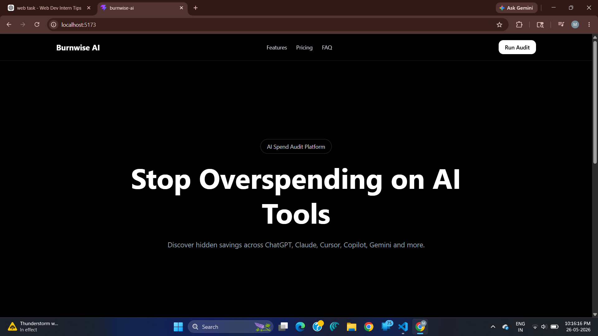
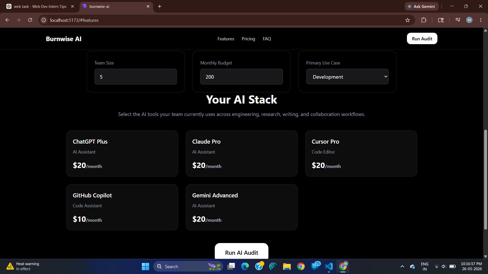
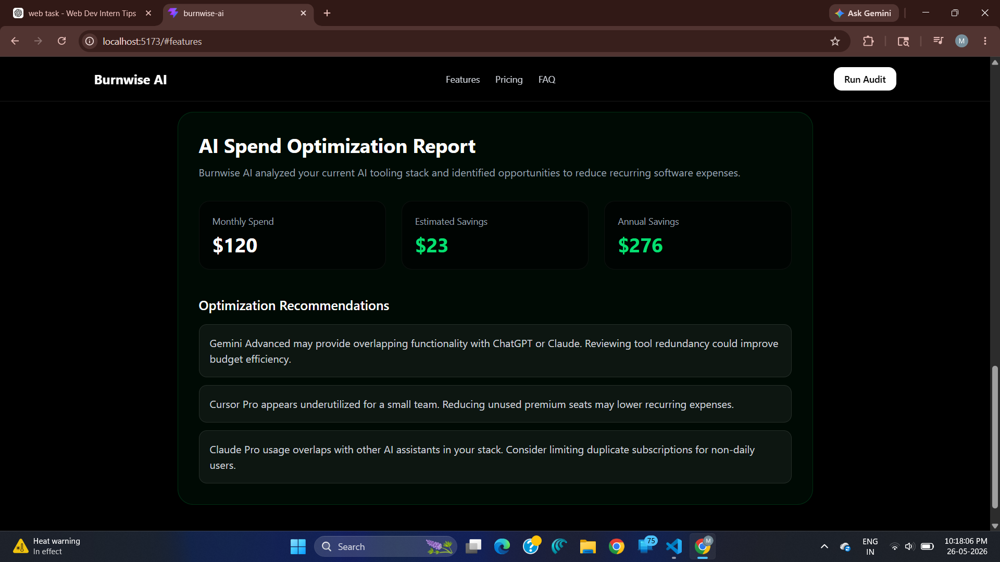

# Burnwise AI

Burnwise AI is an AI spend audit platform that helps startups identify overspending across AI tools like ChatGPT, Claude, Cursor, Copilot, Gemini, and other AI subscriptions.

Users can input their AI stack, monthly spend, team size, budget, and usage preferences to receive actionable optimization recommendations and estimated savings instantly.

---

## Features

- Interactive AI tool selection
- AI spend audit report generation
- Team size and monthly budget controls
- Primary use case selection
- Dynamic savings recommendations
- AI-generated optimization summary
- LocalStorage persistence
- Shareable audit URLs
- Email capture workflow
- Responsive dark-themed dashboard
- Real-time audit calculation logic
- Automated audit engine testing
- GitHub Actions CI workflow
- Open Graph metadata support

---

## Supported AI Tools

- ChatGPT
- Claude
- Cursor
- GitHub Copilot
- Gemini
- OpenAI API
- Anthropic API
- v0

---

## Tech Stack

- React
- TypeScript
- Tailwind CSS
- Vite
- Vitest
- GitHub Actions
- Vercel

---

## Deployment

Live Deployment: https://burnwise-ai.vercel.app

---

## Screenshots

### Landing Page



### AI Stack Selection



### AI Spend Optimization Report



---

## Project Structure

```bash
src/
├── components/
├── data/
├── tests/
├── types/
├── utils/
└── App.tsx
```

---

## Installation

```bash
npm install
npm run dev
```

---

## Run Tests

```bash
npm run test
```

---

## Documentation

- FEATURES.md
- ARCHITECTURE.md
- DEVLOG.md
- REFLECTION.md
- GTM.md
- ECONOMICS.md
- METRICS.md
- LANDING_COPY.md
- USER_INTERVIEWS.md
- TESTS.md
- PRICING_DATA.md
- PROMPTS.md

---

## Decisions

1. Chose React + TypeScript for maintainable component-based architecture.
2. Used localStorage instead of a full backend database to keep MVP scope manageable within the assignment timeline.
3. Prioritized realistic audit recommendations over complex AI-generated calculations.
4. Focused on responsive SaaS-style UI to improve shareability and product feel.
5. Added automated tests specifically around audit logic because pricing calculations are core business functionality.

---

## Status

Frontend MVP completed and deployed successfully.